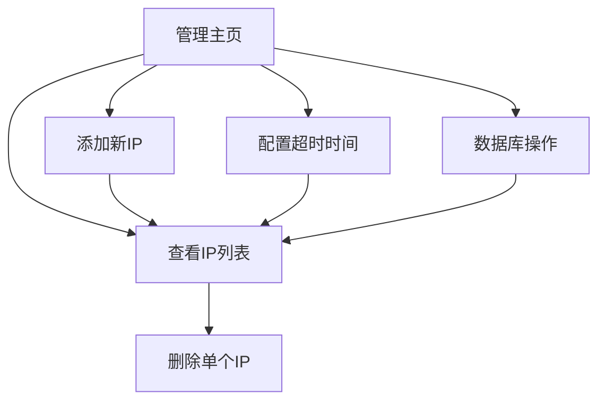

# IP记录管理系统 - 产品需求文档

## 1. Product Overview
IP记录管理系统是一个轻量级的IP地址记录和管理工具，支持IP地址的添加、查询、自动过期删除等功能。
- 主要解决IP地址临时记录和管理的需求，适用于需要跟踪和管理IP访问记录的场景。
- 目标用户为系统管理员和开发人员，提供简单易用的Web管理界面。

## 2. Core Features

### 2.1 User Roles
本系统无需用户角色区分，所有功能对所有访问者开放。

### 2.2 Feature Module
我们的IP记录管理系统包含以下主要页面：
1. **管理主页**：IP列表展示、添加IP功能、超时配置、数据库操作按钮。

### 2.3 Page Details

| Page Name | Module Name | Feature description |
|-----------|-------------|---------------------|
| 管理主页 | IP列表模块 | 显示所有IP记录，包含序号、IP地址、添加时间、到期时间；支持单项删除操作 |
| 管理主页 | IP添加模块 | 提供输入框和按钮，支持手动添加新的IP地址到数据库 |
| 管理主页 | 超时配置模块 | 显示当前超时设置，提供输入框修改超时秒数配置 |
| 管理主页 | 数据库操作模块 | 提供清空数据库和刷新列表的按钮功能 |

## 3. Core Process

### 主要用户操作流程：
1. 用户访问管理页面，查看当前IP列表
2. 用户可以通过添加模块输入新IP地址并提交
3. 用户可以在列表中手动删除指定IP记录
4. 用户可以修改超时配置，影响后续IP的自动过期时间
5. 用户可以清空所有数据或刷新列表查看最新状态
6. 系统自动根据超时配置删除过期的IP记录

## 4. User Interface Design

### 4.1 Design Style
- 主色调：#409EFF（Element Plus 默认蓝色），辅助色：#67C23A（成功绿色）、#F56C6C（危险红色）
- 按钮样式：Element Plus 默认圆角按钮风格
- 字体：系统默认字体，主要文字14px，标题16px
- 布局风格：卡片式布局，顶部导航，内容区域使用Card组件
- 图标风格：Element Plus 内置图标

### 4.2 Page Design Overview

| Page Name | Module Name | UI Elements |
|-----------|-------------|-------------|
| 管理主页 | 页面标题 | 居中显示"IP记录管理系统"，使用h1标签，颜色#303133 |
| 管理主页 | IP列表模块 | 使用el-table组件，包含序号、IP地址、添加时间、到期时间、操作列；操作列包含红色删除按钮 |
| 管理主页 | IP添加模块 | 使用el-card包装，包含el-input输入框和蓝色el-button提交按钮 |
| 管理主页 | 超时配置模块 | 使用el-card包装，显示当前超时值，包含数字输入框和保存按钮 |
| 管理主页 | 数据库操作模块 | 使用el-card包装，包含红色"清空数据库"按钮和蓝色"刷新列表"按钮 |

### 4.3 Responsiveness
系统采用桌面优先设计，支持移动端自适应，使用Element Plus的响应式栅格系统确保在不同屏幕尺寸下的良好显示效果。