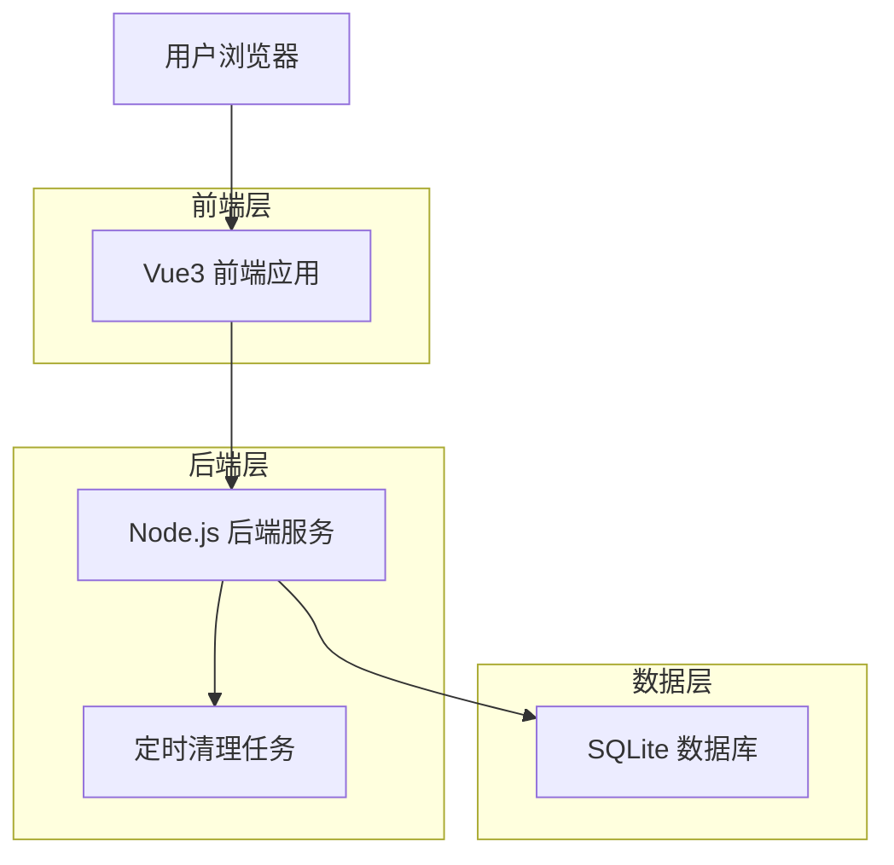
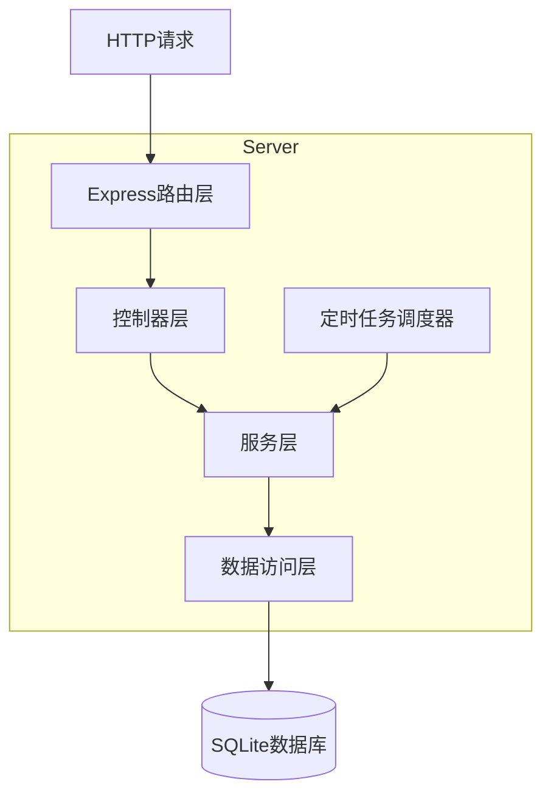
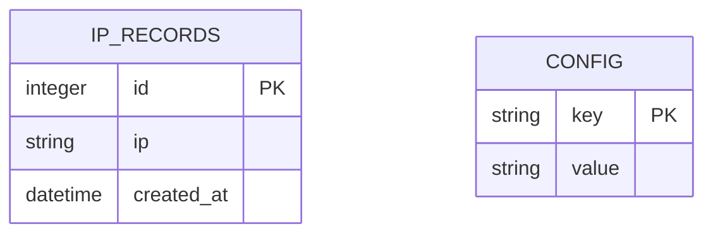

# IP记录管理系统 - 技术架构文档

## 1. Architecture design



## 2. Technology Description

* Frontend: Vue\@3 + Element Plus + TypeScript + Vite

* Backend: Node.js + Express + TypeScript

* Database: SQLite

* Package Manager: npm

## 3. Route definitions

| Route | Purpose            |
| ----- | ------------------ |
| /     | 管理主页，显示IP列表和所有管理功能 |

## 4. API definitions

### 4.1 Core API

#### IP管理相关接口

**添加IP记录**

```
GET /api/ip/add?ip={ip_address}
```

Request:

| Param Name | Param Type | isRequired | Description |
| ---------- | ---------- | ---------- | ----------- |
| ip         | string     | true       | 要添加的IP地址    |

Response:

| Param Name | Param Type | Description |
| ---------- | ---------- | ----------- |
| success    | boolean    | 操作是否成功      |
| message    | string     | 返回消息        |

Example:

```json
{
  "success": true,
  "message": "IP添加成功"
}
```

**检查IP是否存在**

```
GET /api/ip/check?ip={ip_address}
```

Request:

| Param Name | Param Type | isRequired | Description |
| ---------- | ---------- | ---------- | ----------- |
| ip         | string     | true       | 要检查的IP地址    |

Response:

| Param Name | Param Type | Description  |
| ---------- | ---------- | ------------ |
| exists     | boolean    | IP是否存在于数据库中  |
| data       | object     | IP记录详情（如果存在） |

Example:

```json
{
  "exists": true,
  "data": {
    "id": 1,
    "ip": "192.168.1.1",
    "created_at": "2024-01-01T10:00:00Z"
  }
}
```

**设置超时配置**

```
GET /api/ip/set?timeout={seconds}
```

Request:

| Param Name | Param Type | isRequired | Description |
| ---------- | ---------- | ---------- | ----------- |
| timeout    | number     | true       | 超时秒数        |

Response:

| Param Name | Param Type | Description |
| ---------- | ---------- | ----------- |
| success    | boolean    | 操作是否成功      |
| timeout    | number     | 设置的超时值      |

Example:

```json
{
  "success": true,
  "timeout": 3600
}
```

**获取当前超时配置**

```
GET /api/ip/timeout
```

Response:

| Param Name | Param Type | Description |
| ---------- | ---------- | ----------- |
| timeout    | number     | 当前超时秒数      |

Example:

```json
{
  "timeout": 3600
}
```

#### 管理接口

**获取IP列表**

```
GET /api/ip/list
```

Response:

| Param Name | Param Type | Description |
| ---------- | ---------- | ----------- |
| data       | array      | IP记录列表      |

Example:

```json
{
  "data": [
    {
      "id": 1,
      "ip": "192.168.1.1",
      "created_at": "2024-01-01T10:00:00Z"
    }
  ]
}
```

**删除IP记录**

```
DELETE /api/ip/delete/{id}
```

Request:

| Param Name | Param Type | isRequired | Description |
| ---------- | ---------- | ---------- | ----------- |
| id         | number     | true       | IP记录ID      |

Response:

| Param Name | Param Type | Description |
| ---------- | ---------- | ----------- |
| success    | boolean    | 操作是否成功      |

**清空所有IP记录**

```
DELETE /api/ip/clear
```

Response:

| Param Name | Param Type | Description |
| ---------- | ---------- | ----------- |
| success    | boolean    | 操作是否成功      |
| message    | string     | 返回消息        |

## 5. Server architecture diagram



## 6. Data model

### 6.1 Data model definition



### 6.2 Data Definition Language

**IP记录表 (ip\_records)**

```sql
-- 创建IP记录表
CREATE TABLE ip_records (
    id INTEGER PRIMARY KEY AUTOINCREMENT,
    ip VARCHAR(45) NOT NULL UNIQUE,
    created_at DATETIME DEFAULT CURRENT_TIMESTAMP
);

-- 创建索引
CREATE INDEX idx_ip_records_ip ON ip_records(ip);
CREATE INDEX idx_ip_records_created_at ON ip_records(created_at);
```

**配置表 (config)**

```sql
-- 创建配置表
CREATE TABLE config (
    key VARCHAR(50) PRIMARY KEY,
    value TEXT NOT NULL
);

-- 初始化数据
INSERT INTO config (key, value) VALUES ('timeout', '3600');
```

**清理过期记录的SQL**

```sql
-- 删除过期IP记录
DELETE FROM ip_records 
WHERE datetime(created_at, '+' || (SELECT value FROM config WHERE key = 'timeout') || ' seconds') < datetime('now');
```

